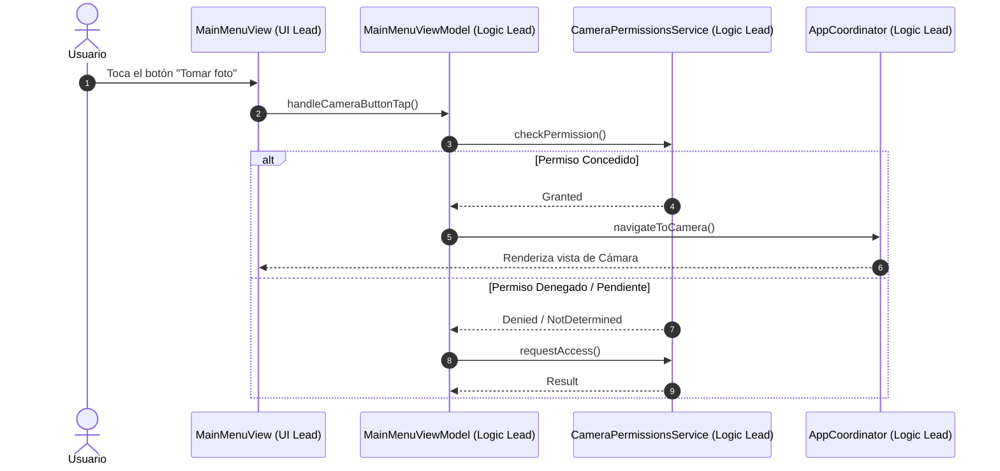

```mermaid
sequenceDiagram
    autonumber
    actor Usuario
    participant View as MainMenuView (UI Lead)
    participant VM as MainMenuViewModel (Logic Lead)
    participant Service as CameraPermissionsService (Logic Lead)
    participant Router as AppCoordinator (Logic Lead)

    Usuario->>View: Toca el botón "Tomar foto"
    View->>VM: handleCameraButtonTap()
    VM->>Service: checkPermission()
    
    alt Permiso Concedido
        Service-->>VM: Granted
        VM->>Router: navigateToCamera()
        Router-->>View: Renderiza vista de Cámara
    else Permiso Denegado / Pendiente
        Service-->>VM: Denied / NotDetermined
        VM->>Service: requestAccess()
        Service-->>VM: Result
    end
```