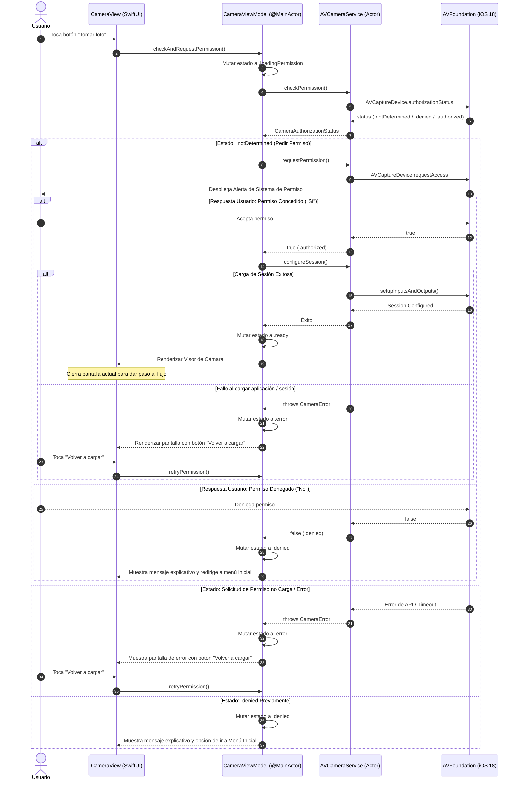

```mermaid
sequenceDiagram
    autonumber
    actor Usuario
    participant View as CameraView (SwiftUI)
    participant VM as CameraViewModel (@MainActor)
    participant Service as AVCameraService (Actor)
    participant AVSystem as AVFoundation (iOS 18)

    Usuario->>View: Toca botón "Tomar foto"
    View->>VM: checkAndRequestPermission()
    VM->>VM: Mutar estado a .loadingPermission
    VM->>Service: checkPermission()
    Service->>AVSystem: AVCaptureDevice.authorizationStatus
    AVSystem-->>Service: status (.notDetermined / .denied / .authorized)
    Service-->>VM: CameraAuthorizationStatus

    alt Estado: .notDetermined (Pedir Permiso)
        VM->>Service: requestPermission()
        Service->>AVSystem: AVCaptureDevice.requestAccess
        AVSystem-->>Usuario: Despliega Alerta de Sistema de Permiso
        
        alt Respuesta Usuario: Permiso Concedido ("Sí")
            Usuario-->>AVSystem: Acepta permiso
            AVSystem-->>Service: true
            Service-->>VM: true (.authorized)
            VM->>Service: configureSession()
            
            alt Carga de Sesión Exitosa
                Service->>AVSystem: setupInputsAndOutputs()
                AVSystem-->>Service: Session Configured
                Service-->>VM: Éxito
                VM->>VM: Mutar estado a .ready
                VM-->>View: Renderizar Visor de Cámara
                Note over View: Cierra pantalla actual para dar paso al flujo
            else Fallo al cargar aplicación / sesión
                Service-->>VM: throws CameraError
                VM->>VM: Mutar estado a .error
                VM-->>View: Renderizar pantalla con botón "Volver a cargar"
                Usuario->>View: Toca "Volver a cargar"
                View->>VM: retryPermission()
            end

        else Respuesta Usuario: Permiso Denegado ("No")
            Usuario-->>AVSystem: Deniega permiso
            AVSystem-->>Service: false
            Service-->>VM: false (.denied)
            VM->>VM: Mutar estado a .denied
            VM-->>View: Muestra mensaje explicativo y redirige a menú inicial
        end

    else Estado: Solicitud de Permiso no Carga / Error
        AVSystem-->>Service: Error de API / Timeout
        Service-->>VM: throws CameraError
        VM->>VM: Mutar estado a .error
        VM-->>View: Muestra pantalla de error con botón "Volver a cargar"
        Usuario->>View: Toca "Volver a cargar"
        View->>VM: retryPermission()

    else Estado: .denied Previamente
        VM->>VM: Mutar estado a .denied
        VM-->>View: Muestra mensaje explicativo y opción de ir a Menú Inicial
    end
```
