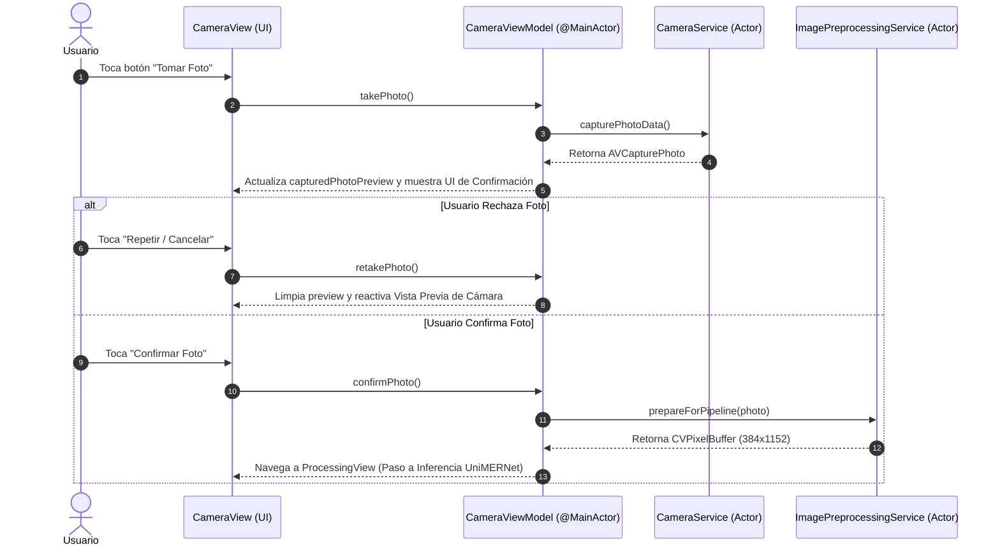

```mermaid
sequenceDiagram
    autonumber
    actor Usuario
    participant View as CameraView (UI)
    participant VM as CameraViewModel (@MainActor)
    participant CS as CameraService (Actor)
    participant IP as ImagePreprocessingService (Actor)

    Usuario->>View: Toca botón "Tomar Foto"
    View->>VM: takePhoto()
    VM->>CS: capturePhotoData()
    CS-->>VM: Retorna AVCapturePhoto
    VM-->>View: Actualiza capturedPhotoPreview y muestra UI de Confirmación

    alt Usuario Rechaza Foto
        Usuario->>View: Toca "Repetir / Cancelar"
        View->>VM: retakePhoto()
        VM-->>View: Limpia preview y reactiva Vista Previa de Cámara
    else Usuario Confirma Foto
        Usuario->>View: Toca "Confirmar Foto"
        View->>VM: confirmPhoto()
        VM->>IP: prepareForPipeline(photo)
        IP-->>VM: Retorna CVPixelBuffer (384x1152)
        VM-->>View: Navega a ProcessingView (Paso a Inferencia UniMERNet)
    end
```
