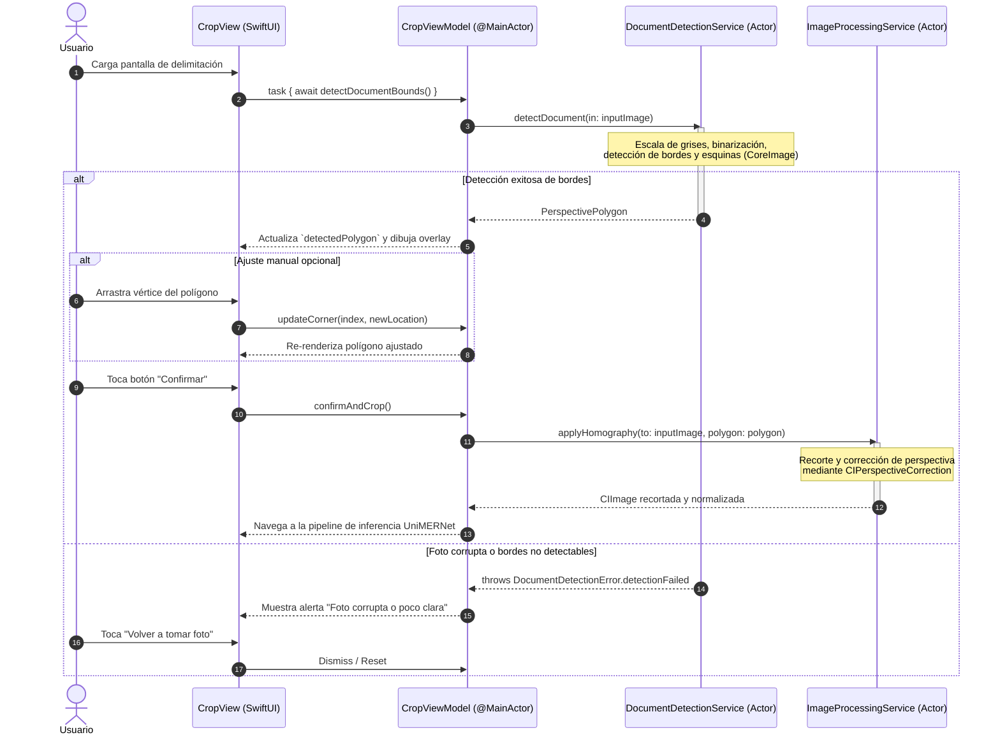

```mermaid
sequenceDiagram
    autonumber
    actor Usuario as Usuario
    participant View as CropView (SwiftUI)
    participant VM as CropViewModel (@MainActor)
    participant DetectService as DocumentDetectionService (Actor)
    participant ProcessService as ImageProcessingService (Actor)

    Usuario->>View: Carga pantalla de delimitación
    View->>VM: task { await detectDocumentBounds() }
    VM->>DetectService: detectDocument(in: inputImage)
    
    activate DetectService
    Note over DetectService: Escala de grises, binarización,<br/>detección de bordes y esquinas (CoreImage)
    
    alt Detección exitosa de bordes
        DetectService-->>VM: PerspectivePolygon
        deactivate DetectService
        VM-->>View: Actualiza `detectedPolygon` y dibuja overlay
        
        alt Ajuste manual opcional
            Usuario->>View: Arrastra vértice del polígono
            View->>VM: updateCorner(index, newLocation)
            VM-->>View: Re-renderiza polígono ajustado
        end
        
        Usuario->>View: Toca botón "Confirmar"
        View->>VM: confirmAndCrop()
        VM->>ProcessService: applyHomography(to: inputImage, polygon: polygon)
        activate ProcessService
        Note over ProcessService: Recorte y corrección de perspectiva<br/>mediante CIPerspectiveCorrection
        ProcessService-->>VM: CIImage recortada y normalizada
        deactivate ProcessService
        VM-->>View: Navega a la pipeline de inferencia UniMERNet
        
    else Foto corrupta o bordes no detectables
        DetectService-->>VM: throws DocumentDetectionError.detectionFailed
        VM-->>View: Muestra alerta "Foto corrupta o poco clara"
        Usuario->>View: Toca "Volver a tomar foto"
        View->>VM: Dismiss / Reset
    end
```
