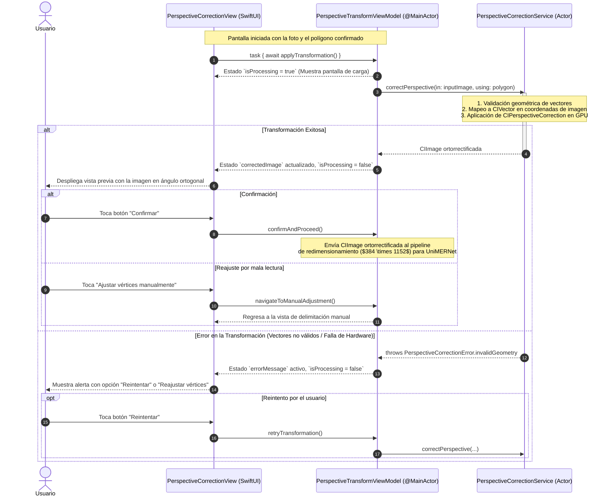

```mermaid
sequenceDiagram
    autonumber
    actor Usuario as Usuario
    participant View as PerspectiveCorrectionView (SwiftUI)
    participant VM as PerspectiveTransformViewModel (@MainActor)
    participant Service as PerspectiveCorrectionService (Actor)

    Note over View, VM: Pantalla iniciada con la foto y el polígono confirmado
    View->>VM: task { await applyTransformation() }
    VM-->>View: Estado `isProcessing = true` (Muestra pantalla de carga)
    
    VM->>Service: correctPerspective(in: inputImage, using: polygon)
    activate Service
    
    Note over Service: 1. Validación geométrica de vectores<br/>2. Mapeo a CIVector en coordenadas de imagen<br/>3. Aplicación de CIPerspectiveCorrection en GPU
    
    alt Transformación Exitosa
        Service-->>VM: CIImage ortorrectificada
        deactivate Service
        VM-->>View: Estado `correctedImage` actualizado, `isProcessing = false`
        View-->>Usuario: Despliega vista previa con la imagen en ángulo ortogonal
        
        alt Confirmación
            Usuario->>View: Toca botón "Confirmar"
            View->>VM: confirmAndProceed()
            Note over VM: Envía CIImage ortorrectificada al pipeline<br/>de redimensionamiento ($384 \times 1152$) para UniMERNet
        else Reajuste por mala lectura
            Usuario->>View: Toca "Ajustar vértices manualmente"
            View->>VM: navigateToManualAdjustment()
            VM-->>View: Regresa a la vista de delimitación manual
        end

    else Error en la Transformación (Vectores no válidos / Falla de Hardware)
        Service-->>VM: throws PerspectiveCorrectionError.invalidGeometry
        VM-->>View: Estado `errorMessage` activo, `isProcessing = false`
        View-->>Usuario: Muestra alerta con opción "Reintentar" o "Reajustar vértices"
        
        opt Reintento por el usuario
            Usuario->>View: Toca botón "Reintentar"
            View->>VM: retryTransformation()
            VM->>Service: correctPerspective(...)
        end
    end
```
