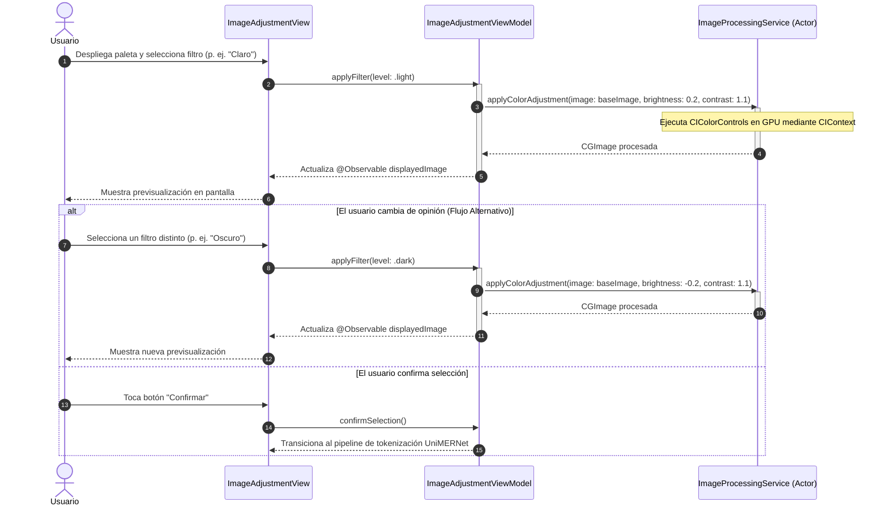

```mermaid
sequenceDiagram
    autonumber
    actor Usuario
    participant View as ImageAdjustmentView
    participant VM as ImageAdjustmentViewModel
    participant Service as ImageProcessingService (Actor)

    Usuario->>View: Despliega paleta y selecciona filtro (p. ej. "Claro")
    View->>VM: applyFilter(level: .light)
    activate VM
    VM->>Service: applyColorAdjustment(image: baseImage, brightness: 0.2, contrast: 1.1)
    activate Service
    Note over Service: Ejecuta CIColorControls en GPU mediante CIContext
    Service-->>VM: CGImage procesada
    deactivate Service
    VM-->>View: Actualiza @Observable displayedImage
    deactivate VM
    View-->>Usuario: Muestra previsualización en pantalla

    alt El usuario cambia de opinión (Flujo Alternativo)
        Usuario->>View: Selecciona un filtro distinto (p. ej. "Oscuro")
        View->>VM: applyFilter(level: .dark)
        activate VM
        VM->>Service: applyColorAdjustment(image: baseImage, brightness: -0.2, contrast: 1.1)
        activate Service
        Service-->>VM: CGImage procesada
        deactivate Service
        VM-->>View: Actualiza @Observable displayedImage
        deactivate VM
        View-->>Usuario: Muestra nueva previsualización
    else El usuario confirma selección
        Usuario->>View: Toca botón "Confirmar"
        View->>VM: confirmSelection()
        VM-->>View: Transiciona al pipeline de tokenización UniMERNet
    end
```
