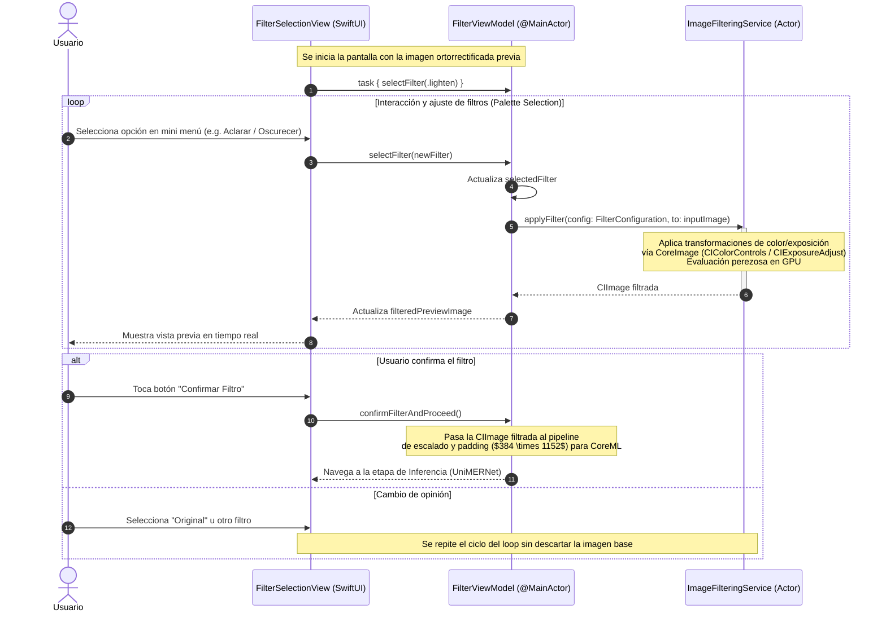

```mermaid
sequenceDiagram
    autonumber
    actor Usuario as Usuario
    participant View as FilterSelectionView (SwiftUI)
    participant VM as FilterViewModel (@MainActor)
    participant Service as ImageFilteringService (Actor)

    Note over View, VM: Se inicia la pantalla con la imagen ortorrectificada previa
    View->>VM: task { selectFilter(.lighten) }

    loop Interacción y ajuste de filtros (Palette Selection)
        Usuario->>View: Selecciona opción en mini menú (e.g. Aclarar / Oscurecer)
        View->>VM: selectFilter(newFilter)
        VM->>VM: Actualiza selectedFilter
        VM->>Service: applyFilter(config: FilterConfiguration, to: inputImage)

        activate Service
        Note over Service: Aplica transformaciones de color/exposición<br/>vía CoreImage (CIColorControls / CIExposureAdjust)<br/>Evaluación perezosa en GPU
        Service-->>VM: CIImage filtrada
        deactivate Service

        VM-->>View: Actualiza filteredPreviewImage
        View-->>Usuario: Muestra vista previa en tiempo real
    end

    alt Usuario confirma el filtro
        Usuario->>View: Toca botón "Confirmar Filtro"
        View->>VM: confirmFilterAndProceed()
        Note over VM: Pasa la CIImage filtrada al pipeline<br/>de escalado y padding ($384 \times 1152$) para CoreML
        VM-->>View: Navega a la etapa de Inferencia (UniMERNet)
    else Cambio de opinión
        Usuario->>View: Selecciona "Original" u otro filtro
        Note over View, Service: Se repite el ciclo del loop sin descartar la imagen base
    end
```
