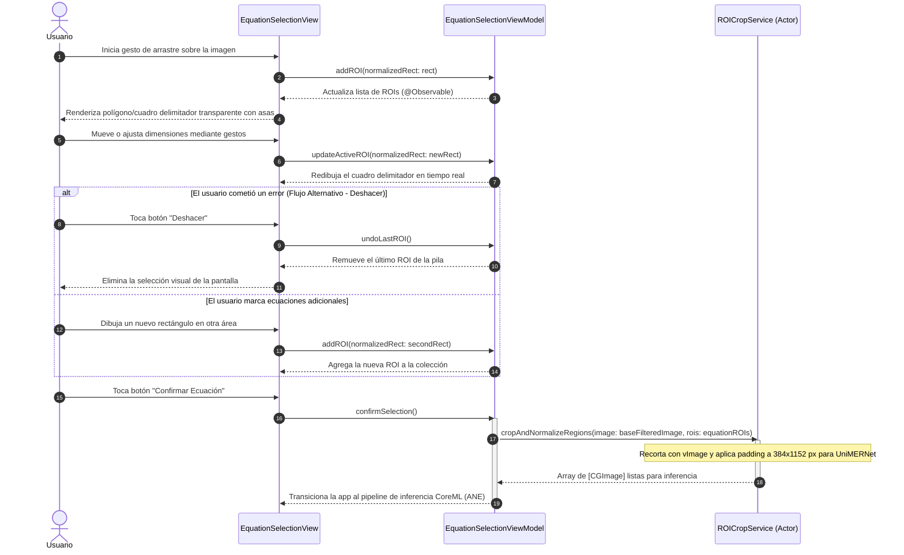

```mermaid
sequenceDiagram
    autonumber
    actor Usuario
    participant View as EquationSelectionView
    participant VM as EquationSelectionViewModel
    participant Service as ROICropService (Actor)

    Usuario->>View: Inicia gesto de arrastre sobre la imagen
    View->>VM: addROI(normalizedRect: rect)
    VM-->>View: Actualiza lista de ROIs (@Observable)
    View-->>Usuario: Renderiza polígono/cuadro delimitador transparente con asas

    Usuario->>View: Mueve o ajusta dimensiones mediante gestos
    View->>VM: updateActiveROI(normalizedRect: newRect)
    VM-->>View: Redibuja el cuadro delimitador en tiempo real

    alt El usuario cometió un error (Flujo Alternativo - Deshacer)
        Usuario->>View: Toca botón "Deshacer"
        View->>VM: undoLastROI()
        VM-->>View: Remueve el último ROI de la pila
        View-->>Usuario: Elimina la selección visual de la pantalla
    else El usuario marca ecuaciones adicionales
        Usuario->>View: Dibuja un nuevo rectángulo en otra área
        View->>VM: addROI(normalizedRect: secondRect)
        VM-->>View: Agrega la nueva ROI a la colección
    end

    Usuario->>View: Toca botón "Confirmar Ecuación"
    View->>VM: confirmSelection()
    activate VM
    VM->>Service: cropAndNormalizeRegions(image: baseFilteredImage, rois: equationROIs)
    activate Service
    Note over Service: Recorta con vImage y aplica padding a 384x1152 px para UniMERNet
    Service-->>VM: Array de [CGImage] listas para inferencia
    deactivate Service
    VM-->>View: Transiciona la app al pipeline de inferencia CoreML (ANE)
    deactivate VM
```
