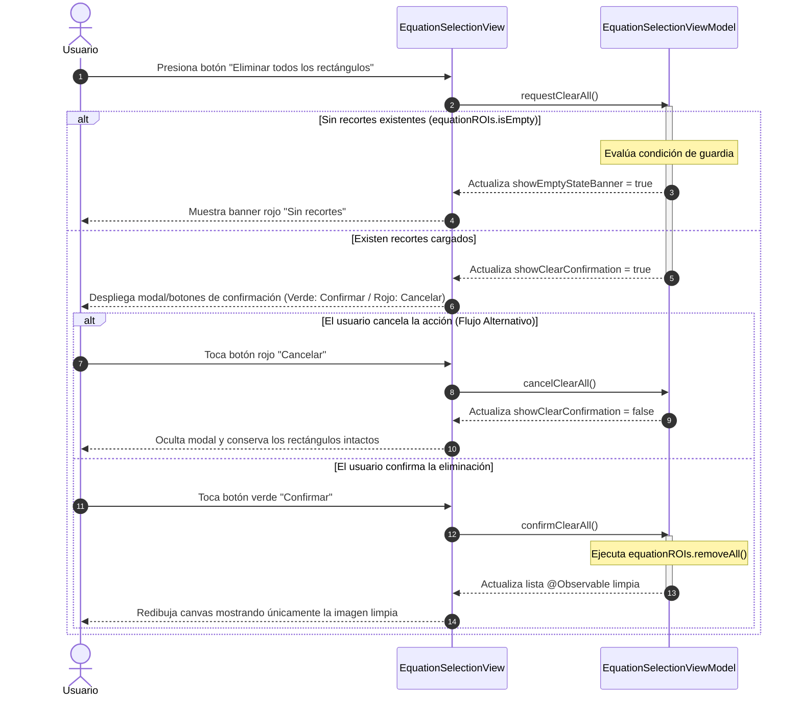

```mermaid
sequenceDiagram
    autonumber
    actor Usuario
    participant View as EquationSelectionView
    participant VM as EquationSelectionViewModel

    Usuario->>View: Presiona botón "Eliminar todos los rectángulos"
    View->>VM: requestClearAll()
    activate VM

    alt Sin recortes existentes (equationROIs.isEmpty)
        Note over VM: Evalúa condición de guardia
        VM-->>View: Actualiza showEmptyStateBanner = true
        View-->>Usuario: Muestra banner rojo "Sin recortes"
    else Existen recortes cargados
        VM-->>View: Actualiza showClearConfirmation = true
        deactivate VM
        View-->>Usuario: Despliega modal/botones de confirmación (Verde: Confirmar / Rojo: Cancelar)

        alt El usuario cancela la acción (Flujo Alternativo)
            Usuario->>View: Toca botón rojo "Cancelar"
            View->>VM: cancelClearAll()
            VM-->>View: Actualiza showClearConfirmation = false
            View-->>Usuario: Oculta modal y conserva los rectángulos intactos
        else El usuario confirma la eliminación
            Usuario->>View: Toca botón verde "Confirmar"
            View->>VM: confirmClearAll()
            activate VM
            Note over VM: Ejecuta equationROIs.removeAll()
            VM-->>View: Actualiza lista @Observable limpia
            deactivate VM
            View-->>Usuario: Redibuja canvas mostrando únicamente la imagen limpia
        end
    end
```
