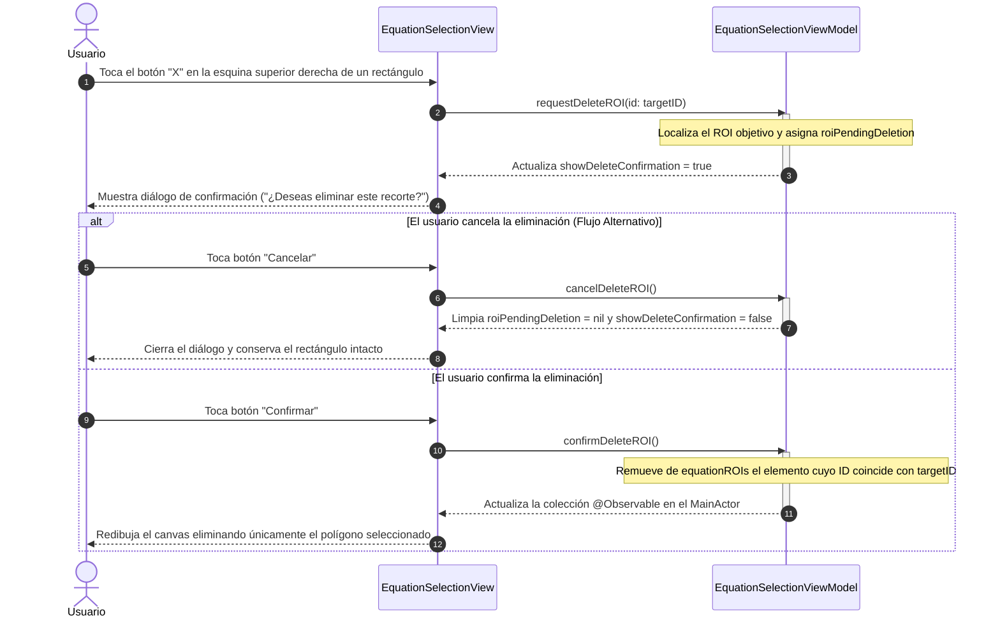

```mermaid
sequenceDiagram
    autonumber
    actor Usuario
    participant View as EquationSelectionView
    participant VM as EquationSelectionViewModel

    Usuario->>View: Toca el botón "X" en la esquina superior derecha de un rectángulo
    View->>VM: requestDeleteROI(id: targetID)
    activate VM
    Note over VM: Localiza el ROI objetivo y asigna roiPendingDeletion
    VM-->>View: Actualiza showDeleteConfirmation = true
    deactivate VM
    View-->>Usuario: Muestra diálogo de confirmación ("¿Deseas eliminar este recorte?")

    alt El usuario cancela la eliminación (Flujo Alternativo)
        Usuario->>View: Toca botón "Cancelar"
        View->>VM: cancelDeleteROI()
        activate VM
        VM-->>View: Limpia roiPendingDeletion = nil y showDeleteConfirmation = false
        deactivate VM
        View-->>Usuario: Cierra el diálogo y conserva el rectángulo intacto
    else El usuario confirma la eliminación
        Usuario->>View: Toca botón "Confirmar"
        View->>VM: confirmDeleteROI()
        activate VM
        Note over VM: Remueve de equationROIs el elemento cuyo ID coincide con targetID
        VM-->>View: Actualiza la colección @Observable en el MainActor
        deactivate VM
        View-->>Usuario: Redibuja el canvas eliminando únicamente el polígono seleccionado
    end
```
