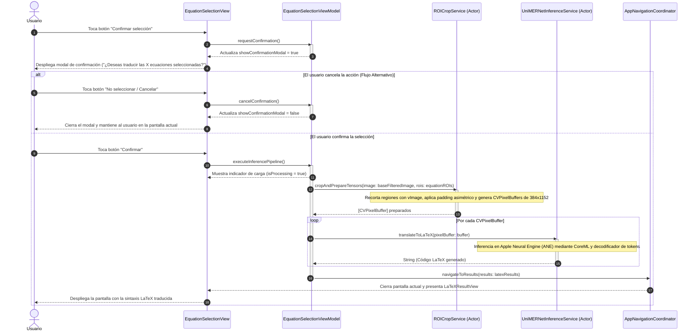

```mermaid
sequenceDiagram
    autonumber
    actor Usuario
    participant View as EquationSelectionView
    participant VM as EquationSelectionViewModel
    participant CropService as ROICropService (Actor)
    participant AIService as UniMERNetInferenceService (Actor)
    participant Nav as AppNavigationCoordinator

    Usuario->>View: Toca botón "Confirmar selección"
    View->>VM: requestConfirmation()
    activate VM
    VM-->>View: Actualiza showConfirmationModal = true
    deactivate VM
    View-->>Usuario: Despliega modal de confirmación ("¿Deseas traducir las X ecuaciones seleccionadas?")

    alt El usuario cancela la acción (Flujo Alternativo)
        Usuario->>View: Toca botón "No seleccionar / Cancelar"
        View->>VM: cancelConfirmation()
        activate VM
        VM-->>View: Actualiza showConfirmationModal = false
        deactivate VM
        View-->>Usuario: Cierra el modal y mantiene al usuario en la pantalla actual
    else El usuario confirma la selección
        Usuario->>View: Toca botón "Confirmar"
        View->>VM: executeInferencePipeline()
        activate VM
        VM-->>View: Muestra indicador de carga (isProcessing = true)

        VM->>CropService: cropAndPrepareTensors(image: baseFilteredImage, rois: equationROIs)
        activate CropService
        Note over CropService: Recorta regiones con vImage, aplica padding asimétrico y genera CVPixelBuffers de 384x1152
        CropService-->>VM: [CVPixelBuffer] preparados
        deactivate CropService

        loop Por cada CVPixelBuffer
            VM->>AIService: translateToLaTeX(pixelBuffer: buffer)
            activate AIService
            Note over AIService: Inferencia en Apple Neural Engine (ANE) mediante CoreML y decodificador de tokens
            AIService-->>VM: String (Código LaTeX generado)
            deactivate AIService
        end

        VM->>Nav: navigateToResults(results: latexResults)
        deactivate VM
        Nav-->>View: Cierra pantalla actual y presenta LaTeXResultView
        View-->>Usuario: Despliega la pantalla con la sintaxis LaTeX traducida
    end
```
