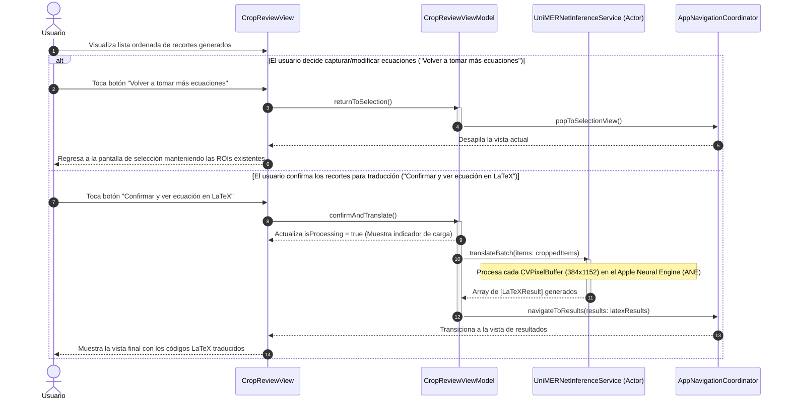

```mermaid
sequenceDiagram
    autonumber
    actor Usuario
    participant View as CropReviewView
    participant VM as CropReviewViewModel
    participant AIService as UniMERNetInferenceService (Actor)
    participant Nav as AppNavigationCoordinator

    Usuario->>View: Visualiza lista ordenada de recortes generados
    
    alt El usuario decide capturar/modificar ecuaciones ("Volver a tomar más ecuaciones")
        Usuario->>View: Toca botón "Volver a tomar más ecuaciones"
        View->>VM: returnToSelection()
        activate VM
        VM->>Nav: popToSelectionView()
        deactivate VM
        Nav-->>View: Desapila la vista actual
        View-->>Usuario: Regresa a la pantalla de selección manteniendo las ROIs existentes
    else El usuario confirma los recortes para traducción ("Confirmar y ver ecuación en LaTeX")
        Usuario->>View: Toca botón "Confirmar y ver ecuación en LaTeX"
        View->>VM: confirmAndTranslate()
        activate VM
        VM-->>View: Actualiza isProcessing = true (Muestra indicador de carga)
        
        VM->>AIService: translateBatch(items: croppedItems)
        activate AIService
        Note over AIService: Procesa cada CVPixelBuffer (384x1152) en el Apple Neural Engine (ANE)
        AIService-->>VM: Array de [LaTeXResult] generados
        deactivate AIService
        
        VM->>Nav: navigateToResults(results: latexResults)
        deactivate VM
        Nav-->>View: Transiciona a la vista de resultados
        View-->>Usuario: Muestra la vista final con los códigos LaTeX traducidos
    end
```
