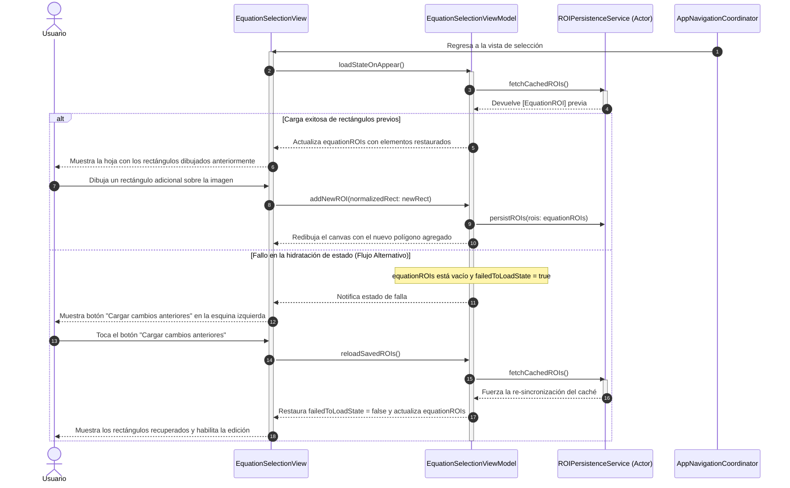

```mermaid
sequenceDiagram
    autonumber
    actor Usuario
    participant View as EquationSelectionView
    participant VM as EquationSelectionViewModel
    participant Persistence as ROIPersistenceService (Actor)
    participant Nav as AppNavigationCoordinator

    Nav->>View: Regresa a la vista de selección
    activate View
    View->>VM: loadStateOnAppear()
    activate VM
    VM->>Persistence: fetchCachedROIs()
    activate Persistence
    Persistence-->>VM: Devuelve [EquationROI] previa
    deactivate Persistence

    alt Carga exitosa de rectángulos previos
        VM-->>View: Actualiza equationROIs con elementos restaurados
        View-->>Usuario: Muestra la hoja con los rectángulos dibujados anteriormente
        
        Usuario->>View: Dibuja un rectángulo adicional sobre la imagen
        View->>VM: addNewROI(normalizedRect: newRect)
        VM->>Persistence: persistROIs(rois: equationROIs)
        VM-->>View: Redibuja el canvas con el nuevo polígono agregado
    else Fallo en la hidratación de estado (Flujo Alternativo)
        Note over VM: equationROIs está vacío y failedToLoadState = true
        VM-->>View: Notifica estado de falla
        View-->>Usuario: Muestra botón "Cargar cambios anteriores" en la esquina izquierda

        Usuario->>View: Toca el botón "Cargar cambios anteriores"
        View->>VM: reloadSavedROIs()
        VM->>Persistence: fetchCachedROIs()
        activate Persistence
        Persistence-->>VM: Fuerza la re-sincronización del caché
        deactivate Persistence
        VM-->>View: Restaura failedToLoadState = false y actualiza equationROIs
        View-->>Usuario: Muestra los rectángulos recuperados y habilita la edición
    end
    deactivate VM
    deactivate View
```
