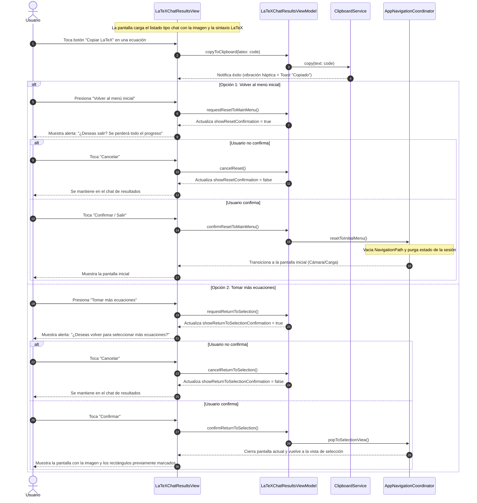

```mermaid
sequenceDiagram
    autonumber
    actor Usuario
    participant View as LaTeXChatResultsView
    participant VM as LaTeXChatResultsViewModel
    participant Clip as ClipboardService
    participant Nav as AppNavigationCoordinator

    Note over View: La pantalla carga el listado tipo chat con la imagen y la sintaxis LaTeX
    Usuario->>View: Toca botón "Copiar LaTeX" en una ecuación
    View->>VM: copyToClipboard(latex: code)
    VM->>Clip: copy(text: code)
    Clip-->>View: Notifica éxito (vibración háptica + Toast "Copiado")

    alt Opción 1: Volver al menú inicial
        Usuario->>View: Presiona "Volver al menú inicial"
        View->>VM: requestResetToMainMenu()
        VM-->>View: Actualiza showResetConfirmation = true
        View-->>Usuario: Muestra alerta: "¿Deseas salir? Se perderá todo el progreso"

        alt Usuario no confirma
            Usuario->>View: Toca "Cancelar"
            View->>VM: cancelReset()
            VM-->>View: Actualiza showResetConfirmation = false
            View-->>Usuario: Se mantiene en el chat de resultados
        else Usuario confirma
            Usuario->>View: Toca "Confirmar / Salir"
            View->>VM: confirmResetToMainMenu()
            VM->>Nav: resetToInitialMenu()
            Note over Nav: Vacia NavigationPath y purga estado de la sesión
            Nav-->>View: Transiciona a la pantalla inicial (Cámara/Carga)
            View-->>Usuario: Muestra la pantalla inicial
        end

    else Opción 2: Tomar más ecuaciones
        Usuario->>View: Presiona "Tomar más ecuaciones"
        View->>VM: requestReturnToSelection()
        VM-->>View: Actualiza showReturnToSelectionConfirmation = true
        View-->>Usuario: Muestra alerta: "¿Deseas volver para seleccionar más ecuaciones?"

        alt Usuario no confirma
            Usuario->>View: Toca "Cancelar"
            View->>VM: cancelReturnToSelection()
            VM-->>View: Actualiza showReturnToSelectionConfirmation = false
            View-->>Usuario: Se mantiene en el chat de resultados
        else Usuario confirma
            Usuario->>View: Toca "Confirmar"
            View->>VM: confirmReturnToSelection()
            VM->>Nav: popToSelectionView()
            Nav-->>View: Cierra pantalla actual y vuelve a la vista de selección
            View-->>Usuario: Muestra la pantalla con la imagen y los rectángulos previamente marcados
        end
    end
```
