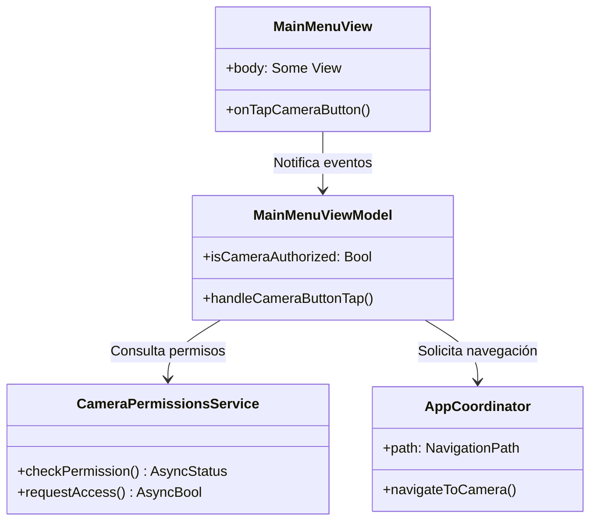

```mermaid
classDiagram
    class MainMenuView {
        +body: Some View
        +onTapCameraButton()
    }

    class MainMenuViewModel {
        +isCameraAuthorized: Bool
        +handleCameraButtonTap()
    }

    class CameraPermissionsService {
        +checkPermission() AsyncStatus
        +requestAccess() AsyncBool
    }

    class AppCoordinator {
        +path: NavigationPath
        +navigateToCamera()
    }

    MainMenuView --> MainMenuViewModel : Notifica eventos
    MainMenuViewModel --> CameraPermissionsService : Consulta permisos
    MainMenuViewModel --> AppCoordinator : Solicita navegación
```