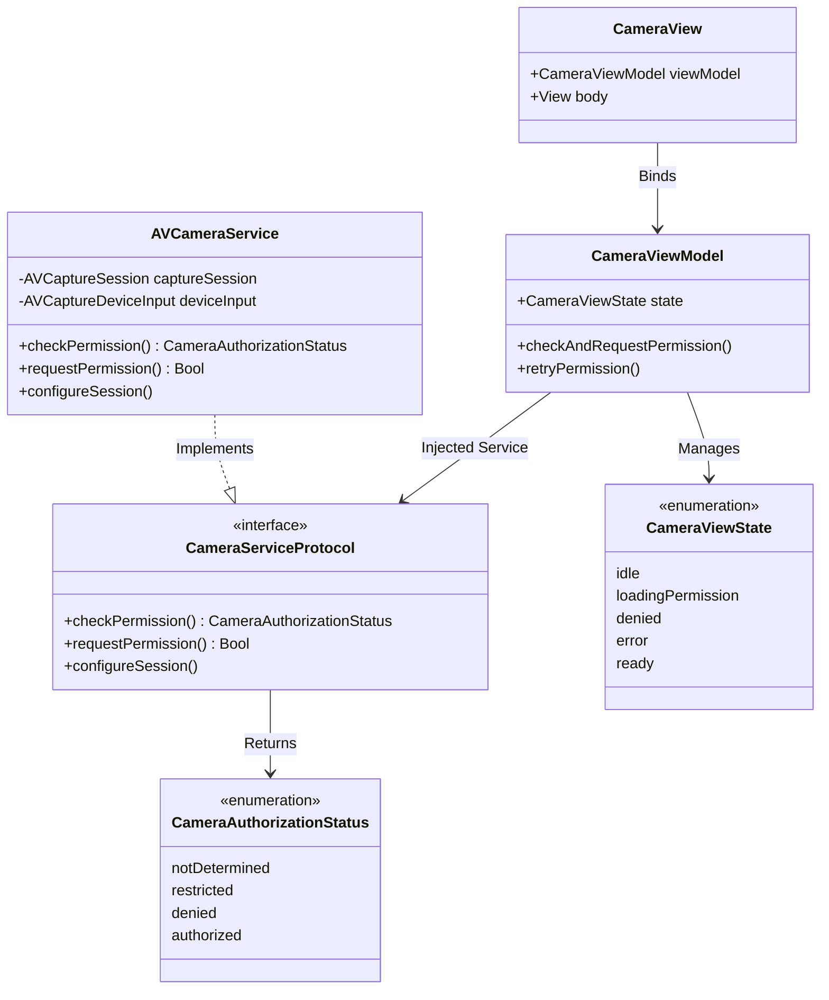

# TX14: Acceder a la cámara

## 1. Diagrama Estático (MVVM + Servicios)

```mermaid
classDiagram
    class CameraView {
        +CameraViewModel viewModel
        +View body
    }

    class CameraViewModel {
        +CameraViewState state
        +checkAndRequestPermission()
        +retryPermission()
    }

    class CameraServiceProtocol {
        <<interface>>
        +checkPermission() CameraAuthorizationStatus
        +requestPermission() Bool
        +configureSession()
    }

    class AVCameraService {
        -AVCaptureSession captureSession
        -AVCaptureDeviceInput deviceInput
        +checkPermission() CameraAuthorizationStatus
        +requestPermission() Bool
        +configureSession()
    }

    class CameraViewState {
        <<enumeration>>
        idle
        loadingPermission
        denied
        error
        ready
    }

    class CameraAuthorizationStatus {
        <<enumeration>>
        notDetermined
        restricted
        denied
        authorized
    }

    CameraView --> CameraViewModel : Binds
    CameraViewModel --> CameraServiceProtocol : Injected Service
    AVCameraService ..|> CameraServiceProtocol : Implements
    CameraViewModel --> CameraViewState : Manages
    CameraServiceProtocol --> CameraAuthorizationStatus : Returns
```
