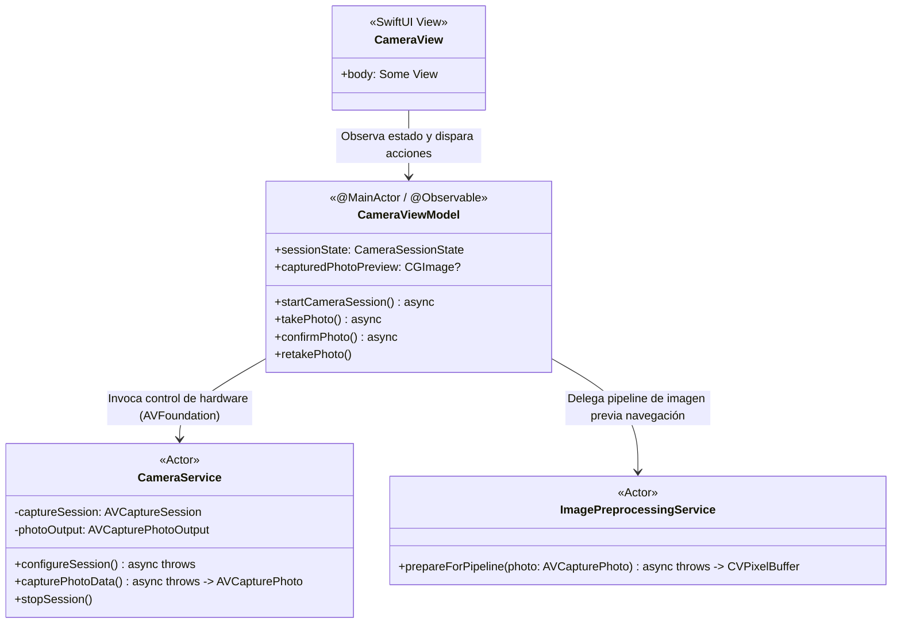

```mermaid
classDiagram
    direction TB

    class CameraView {
        <<SwiftUI View>>
        +body: Some View
    }

    class CameraViewModel {
        <<@MainActor / @Observable>>
        +sessionState: CameraSessionState
        +capturedPhotoPreview: CGImage?
        +startCameraSession() async
        +takePhoto() async
        +confirmPhoto() async
        +retakePhoto()
    }

    class CameraService {
        <<Actor>>
        -captureSession: AVCaptureSession
        -photoOutput: AVCapturePhotoOutput
        +configureSession() async throws
        +capturePhotoData() async throws -> AVCapturePhoto
        +stopSession()
    }

    class ImagePreprocessingService {
        <<Actor>>
        +prepareForPipeline(photo: AVCapturePhoto) async throws -> CVPixelBuffer
    }

    CameraView --> CameraViewModel : Observa estado y dispara acciones
    CameraViewModel --> CameraService : Invoca control de hardware (AVFoundation)
    CameraViewModel --> ImagePreprocessingService : Delega pipeline de imagen previa navegación
```
