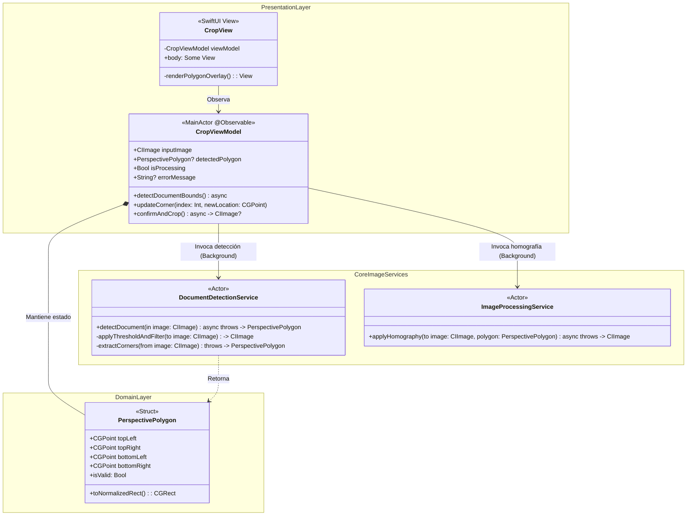

```mermaid
classDiagram
    namespace Presentation Layer {
        class CropView {
            <<SwiftUI View>>
            -CropViewModel viewModel
            +body: Some View
            -renderPolygonOverlay(): View
        }

        class CropViewModel {
            <<MainActor @Observable>>
            +CIImage inputImage
            +PerspectivePolygon? detectedPolygon
            +Bool isProcessing
            +String? errorMessage
            +detectDocumentBounds() async
            +updateCorner(index: Int, newLocation: CGPoint)
            +confirmAndCrop() async -> CIImage?
        }
    }

    namespace Domain Layer {
        class PerspectivePolygon {
            <<Struct>>
            +CGPoint topLeft
            +CGPoint topRight
            +CGPoint bottomLeft
            +CGPoint bottomRight
            +isValid: Bool
            +toNormalizedRect(): CGRect
        }
    }

    namespace Core Image Services {
        class DocumentDetectionService {
            <<Actor>>
            +detectDocument(in image: CIImage) async throws -> PerspectivePolygon
            -applyThresholdAndFilter(to image: CIImage) -> CIImage
            -extractCorners(from image: CIImage) throws -> PerspectivePolygon
        }

        class ImageProcessingService {
            <<Actor>>
            +applyHomography(to image: CIImage, polygon: PerspectivePolygon) async throws -> CIImage
        }
    }

    CropView --> CropViewModel : Observa
    CropViewModel --> DocumentDetectionService : Invoca detección (Background)
    CropViewModel --> ImageProcessingService : Invoca homografía (Background)
    CropViewModel *-- PerspectivePolygon : Mantiene estado
    DocumentDetectionService ..> PerspectivePolygon : Retorna
```
