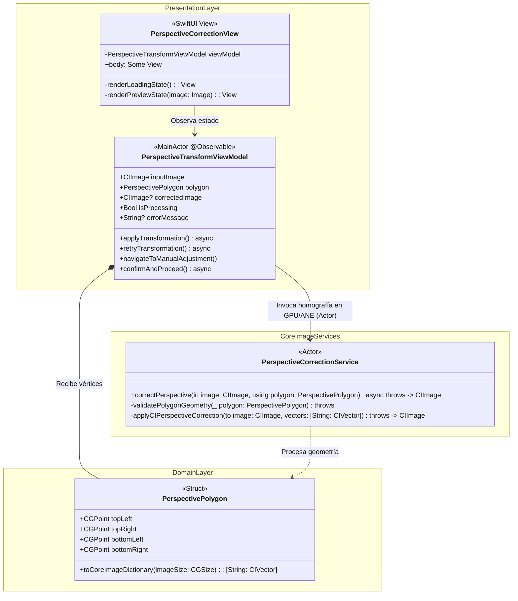

```mermaid
classDiagram
    namespace Presentation Layer {
        class PerspectiveCorrectionView {
            <<SwiftUI View>>
            -PerspectiveTransformViewModel viewModel
            +body: Some View
            -renderLoadingState(): View
            -renderPreviewState(image: Image): View
        }

        class PerspectiveTransformViewModel {
            <<MainActor @Observable>>
            +CIImage inputImage
            +PerspectivePolygon polygon
            +CIImage? correctedImage
            +Bool isProcessing
            +String? errorMessage
            +applyTransformation() async
            +retryTransformation() async
            +navigateToManualAdjustment()
            +confirmAndProceed() async
        }
    }

    namespace Domain Layer {
        class PerspectivePolygon {
            <<Struct>>
            +CGPoint topLeft
            +CGPoint topRight
            +CGPoint bottomLeft
            +CGPoint bottomRight
            +toCoreImageDictionary(imageSize: CGSize): [String: CIVector]
        }
    }

    namespace Core Image Services {
        class PerspectiveCorrectionService {
            <<Actor>>
            +correctPerspective(in image: CIImage, using polygon: PerspectivePolygon) async throws -> CIImage
            -validatePolygonGeometry(_ polygon: PerspectivePolygon) throws
            -applyCIPerspectiveCorrection(to image: CIImage, vectors: [String: CIVector]) throws -> CIImage
        }
    }

    PerspectiveCorrectionView --> PerspectiveTransformViewModel : Observa estado
    PerspectiveTransformViewModel --> PerspectiveCorrectionService : Invoca homografía en GPU/ANE (Actor)
    PerspectiveTransformViewModel *-- PerspectivePolygon : Recibe vértices
    PerspectiveCorrectionService ..> PerspectivePolygon : Procesa geometría
```
