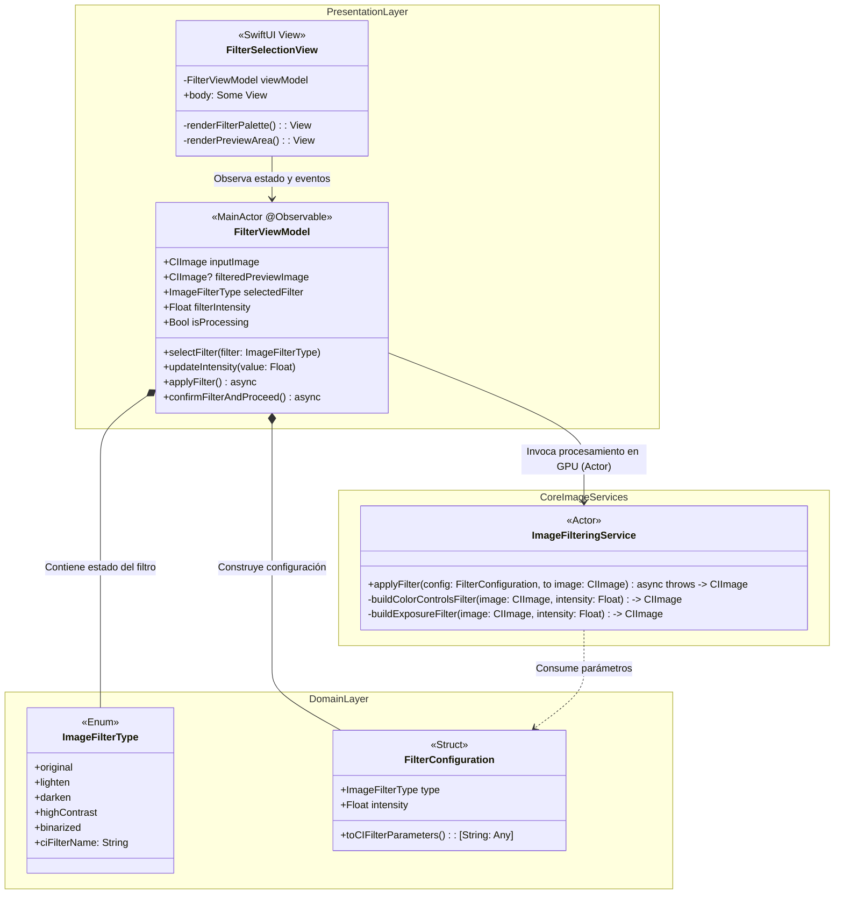

```mermaid
classDiagram
    namespace Presentation Layer {
        class FilterSelectionView {
            <<SwiftUI View>>
            -FilterViewModel viewModel
            +body: Some View
            -renderFilterPalette(): View
            -renderPreviewArea(): View
        }

        class FilterViewModel {
            <<MainActor @Observable>>
            +CIImage inputImage
            +CIImage? filteredPreviewImage
            +ImageFilterType selectedFilter
            +Float filterIntensity
            +Bool isProcessing
            +selectFilter(filter: ImageFilterType)
            +updateIntensity(value: Float)
            +applyFilter() async
            +confirmFilterAndProceed() async
        }
    }

    namespace Domain Layer {
        class ImageFilterType {
            <<Enum>>
            +original
            +lighten
            +darken
            +highContrast
            +binarized
            +ciFilterName: String
        }

        class FilterConfiguration {
            <<Struct>>
            +ImageFilterType type
            +Float intensity
            +toCIFilterParameters(): [String: Any]
        }
    }

    namespace Core Image Services {
        class ImageFilteringService {
            <<Actor>>
            +applyFilter(config: FilterConfiguration, to image: CIImage) async throws -> CIImage
            -buildColorControlsFilter(image: CIImage, intensity: Float) -> CIImage
            -buildExposureFilter(image: CIImage, intensity: Float) -> CIImage
        }
    }

    FilterSelectionView --> FilterViewModel : Observa estado y eventos
    FilterViewModel --> ImageFilteringService : Invoca procesamiento en GPU (Actor)
    FilterViewModel *-- ImageFilterType : Contiene estado del filtro
    FilterViewModel *-- FilterConfiguration : Construye configuración
    ImageFilteringService ..> FilterConfiguration : Consume parámetros
```
