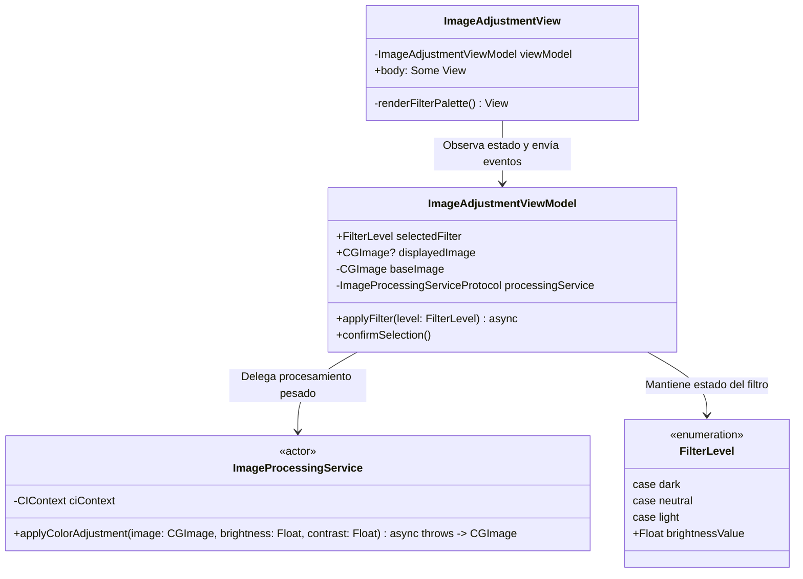

```mermaid
classDiagram
    class ImageAdjustmentView {
        -ImageAdjustmentViewModel viewModel
        +body: Some View
        -renderFilterPalette() View
    }

    class ImageAdjustmentViewModel {
        +FilterLevel selectedFilter
        +CGImage? displayedImage
        -CGImage baseImage
        -ImageProcessingServiceProtocol processingService
        +applyFilter(level: FilterLevel) async
        +confirmSelection()
    }

    class ImageProcessingService {
        <<actor>>
        -CIContext ciContext
        +applyColorAdjustment(image: CGImage, brightness: Float, contrast: Float) async throws -> CGImage
    }

    class FilterLevel {
        <<enumeration>>
        case dark
        case neutral
        case light
        +Float brightnessValue
    }

    ImageAdjustmentView --> ImageAdjustmentViewModel : Observa estado y envía eventos
    ImageAdjustmentViewModel --> ImageProcessingService : Delega procesamiento pesado
    ImageAdjustmentViewModel --> FilterLevel : Mantiene estado del filtro
```
