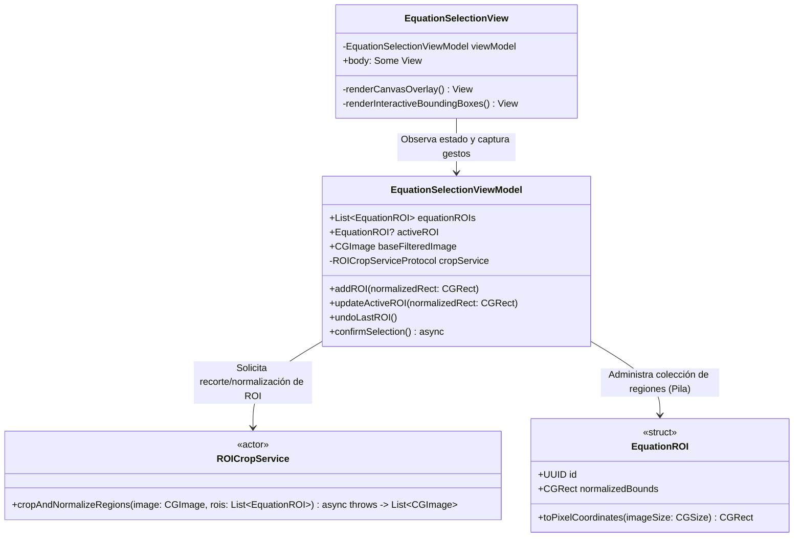

```mermaid
classDiagram
    class EquationSelectionView {
        -EquationSelectionViewModel viewModel
        +body: Some View
        -renderCanvasOverlay() View
        -renderInteractiveBoundingBoxes() View
    }

    class EquationSelectionViewModel {
        +List~EquationROI~ equationROIs
        +EquationROI? activeROI
        +CGImage baseFilteredImage
        -ROICropServiceProtocol cropService
        +addROI(normalizedRect: CGRect)
        +updateActiveROI(normalizedRect: CGRect)
        +undoLastROI()
        +confirmSelection() async
    }

    class ROICropService {
        <<actor>>
        +cropAndNormalizeRegions(image: CGImage, rois: List~EquationROI~) async throws -> List~CGImage~
    }

    class EquationROI {
        <<struct>>
        +UUID id
        +CGRect normalizedBounds
        +toPixelCoordinates(imageSize: CGSize) CGRect
    }

    EquationSelectionView --> EquationSelectionViewModel : Observa estado y captura gestos
    EquationSelectionViewModel --> ROICropService : Solicita recorte/normalización de ROI
    EquationSelectionViewModel --> EquationROI : Administra colección de regiones (Pila)
```
