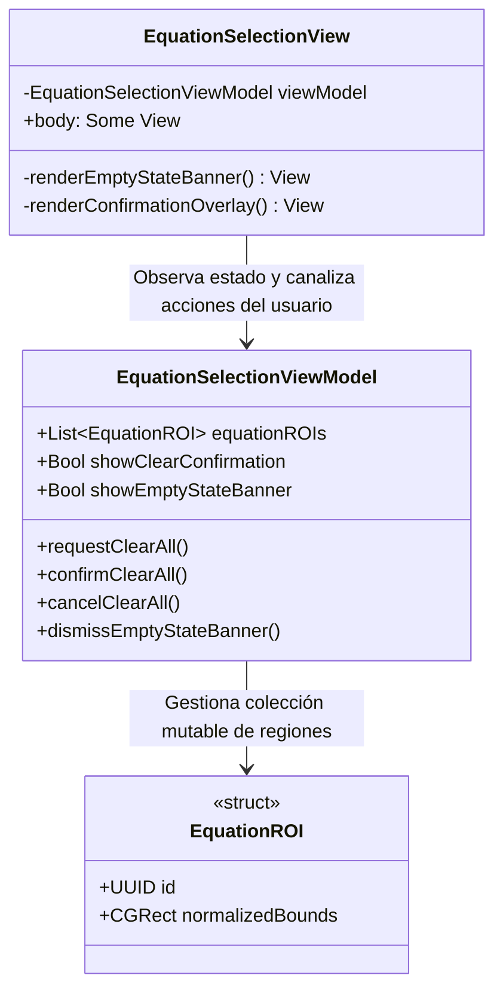

```mermaid
classDiagram
    class EquationSelectionView {
        -EquationSelectionViewModel viewModel
        +body: Some View
        -renderEmptyStateBanner() View
        -renderConfirmationOverlay() View
    }

    class EquationSelectionViewModel {
        +List~EquationROI~ equationROIs
        +Bool showClearConfirmation
        +Bool showEmptyStateBanner
        +requestClearAll()
        +confirmClearAll()
        +cancelClearAll()
        +dismissEmptyStateBanner()
    }

    class EquationROI {
        <<struct>>
        +UUID id
        +CGRect normalizedBounds
    }

    EquationSelectionView --> EquationSelectionViewModel : Observa estado y canaliza acciones del usuario
    EquationSelectionViewModel --> EquationROI : Gestiona colección mutable de regiones
```
