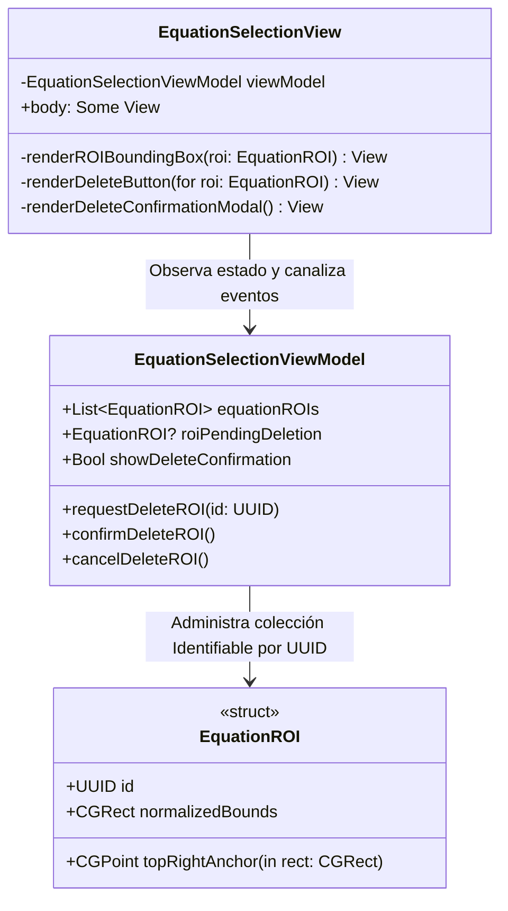

```mermaid
classDiagram
    class EquationSelectionView {
        -EquationSelectionViewModel viewModel
        +body: Some View
        -renderROIBoundingBox(roi: EquationROI) View
        -renderDeleteButton(for roi: EquationROI) View
        -renderDeleteConfirmationModal() View
    }

    class EquationSelectionViewModel {
        +List~EquationROI~ equationROIs
        +EquationROI? roiPendingDeletion
        +Bool showDeleteConfirmation
        +requestDeleteROI(id: UUID)
        +confirmDeleteROI()
        +cancelDeleteROI()
    }

    class EquationROI {
        <<struct>>
        +UUID id
        +CGRect normalizedBounds
        +CGPoint topRightAnchor(in rect: CGRect)
    }

    EquationSelectionView --> EquationSelectionViewModel : Observa estado y canaliza eventos
    EquationSelectionViewModel --> EquationROI : Administra colección Identifiable por UUID
```
