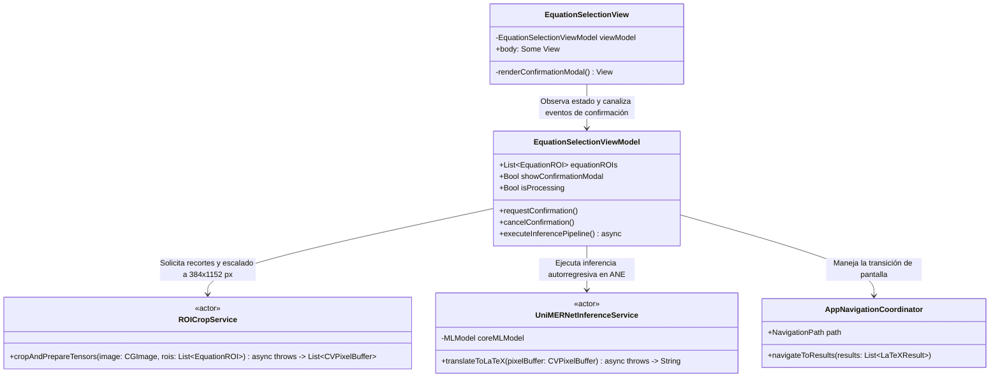

```mermaid
classDiagram
    class EquationSelectionView {
        -EquationSelectionViewModel viewModel
        +body: Some View
        -renderConfirmationModal() View
    }

    class EquationSelectionViewModel {
        +List~EquationROI~ equationROIs
        +Bool showConfirmationModal
        +Bool isProcessing
        +requestConfirmation()
        +cancelConfirmation()
        +executeInferencePipeline() async
    }

    class ROICropService {
        <<actor>>
        +cropAndPrepareTensors(image: CGImage, rois: List~EquationROI~) async throws -> List~CVPixelBuffer~
    }

    class UniMERNetInferenceService {
        <<actor>>
        -MLModel coreMLModel
        +translateToLaTeX(pixelBuffer: CVPixelBuffer) async throws -> String
    }

    class AppNavigationCoordinator {
        +NavigationPath path
        +navigateToResults(results: List~LaTeXResult~)
    }

    EquationSelectionView --> EquationSelectionViewModel : Observa estado y canaliza eventos de confirmación
    EquationSelectionViewModel --> ROICropService : Solicita recortes y escalado a 384x1152 px
    EquationSelectionViewModel --> UniMERNetInferenceService : Ejecuta inferencia autorregresiva en ANE
    EquationSelectionViewModel --> AppNavigationCoordinator : Maneja la transición de pantalla
```
