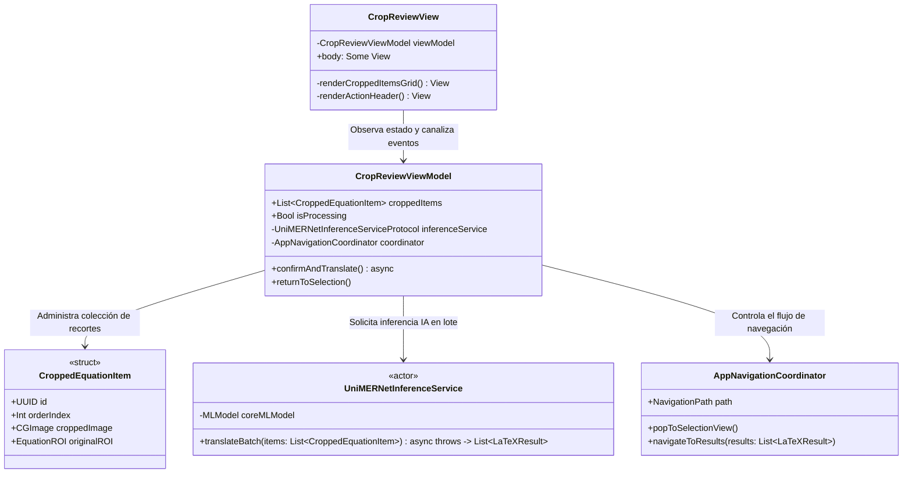

```mermaid
classDiagram
    class CropReviewView {
        -CropReviewViewModel viewModel
        +body: Some View
        -renderCroppedItemsGrid() View
        -renderActionHeader() View
    }

    class CropReviewViewModel {
        +List~CroppedEquationItem~ croppedItems
        +Bool isProcessing
        -UniMERNetInferenceServiceProtocol inferenceService
        -AppNavigationCoordinator coordinator
        +confirmAndTranslate() async
        +returnToSelection()
    }

    class CroppedEquationItem {
        <<struct>>
        +UUID id
        +Int orderIndex
        +CGImage croppedImage
        +EquationROI originalROI
    }

    class UniMERNetInferenceService {
        <<actor>>
        -MLModel coreMLModel
        +translateBatch(items: List~CroppedEquationItem~) async throws -> List~LaTeXResult~
    }

    class AppNavigationCoordinator {
        +NavigationPath path
        +popToSelectionView()
        +navigateToResults(results: List~LaTeXResult~)
    }

    CropReviewView --> CropReviewViewModel : Observa estado y canaliza eventos
    CropReviewViewModel --> CroppedEquationItem : Administra colección de recortes
    CropReviewViewModel --> UniMERNetInferenceService : Solicita inferencia IA en lote
    CropReviewViewModel --> AppNavigationCoordinator : Controla el flujo de navegación
```
