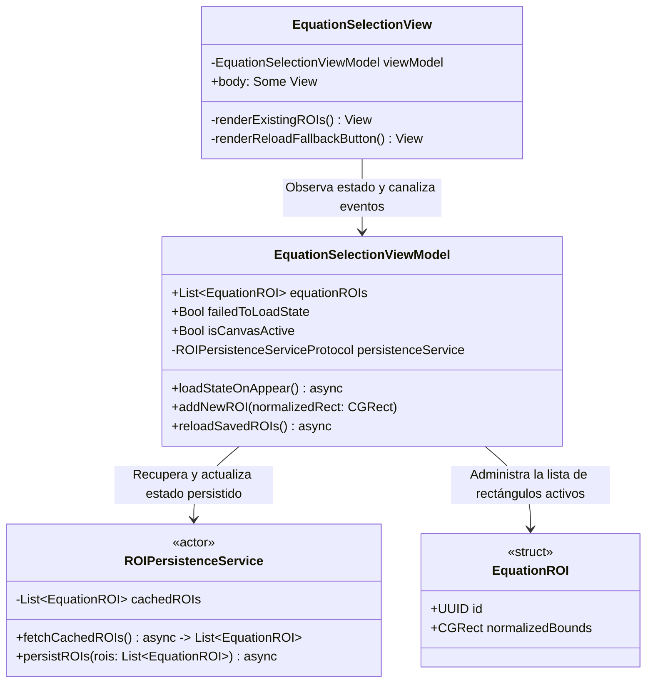

```mermaid
classDiagram
    class EquationSelectionView {
        -EquationSelectionViewModel viewModel
        +body: Some View
        -renderExistingROIs() View
        -renderReloadFallbackButton() View
    }

    class EquationSelectionViewModel {
        +List~EquationROI~ equationROIs
        +Bool failedToLoadState
        +Bool isCanvasActive
        -ROIPersistenceServiceProtocol persistenceService
        +loadStateOnAppear() async
        +addNewROI(normalizedRect: CGRect)
        +reloadSavedROIs() async
    }

    class ROIPersistenceService {
        <<actor>>
        -List~EquationROI~ cachedROIs
        +fetchCachedROIs() async -> List~EquationROI~
        +persistROIs(rois: List~EquationROI~) async
    }

    class EquationROI {
        <<struct>>
        +UUID id
        +CGRect normalizedBounds
    }

    EquationSelectionView --> EquationSelectionViewModel : Observa estado y canaliza eventos
    EquationSelectionViewModel --> ROIPersistenceService : Recupera y actualiza estado persistido
    EquationSelectionViewModel --> EquationROI : Administra la lista de rectángulos activos
```
