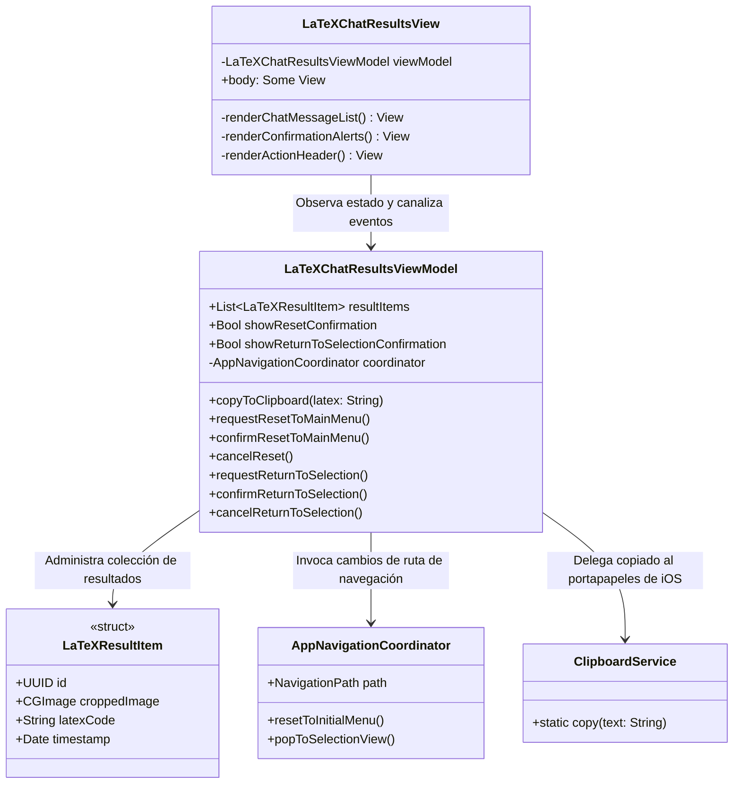

```mermaid
classDiagram
    class LaTeXChatResultsView {
        -LaTeXChatResultsViewModel viewModel
        +body: Some View
        -renderChatMessageList() View
        -renderConfirmationAlerts() View
        -renderActionHeader() View
    }

    class LaTeXChatResultsViewModel {
        +List~LaTeXResultItem~ resultItems
        +Bool showResetConfirmation
        +Bool showReturnToSelectionConfirmation
        -AppNavigationCoordinator coordinator
        +copyToClipboard(latex: String)
        +requestResetToMainMenu()
        +confirmResetToMainMenu()
        +cancelReset()
        +requestReturnToSelection()
        +confirmReturnToSelection()
        +cancelReturnToSelection()
    }

    class LaTeXResultItem {
        <<struct>>
        +UUID id
        +CGImage croppedImage
        +String latexCode
        +Date timestamp
    }

    class AppNavigationCoordinator {
        +NavigationPath path
        +resetToInitialMenu()
        +popToSelectionView()
    }

    class ClipboardService {
        +static copy(text: String)
    }

    LaTeXChatResultsView --> LaTeXChatResultsViewModel : Observa estado y canaliza eventos
    LaTeXChatResultsViewModel --> LaTeXResultItem : Administra colección de resultados
    LaTeXChatResultsViewModel --> AppNavigationCoordinator : Invoca cambios de ruta de navegación
    LaTeXChatResultsViewModel --> ClipboardService : Delega copiado al portapapeles de iOS
```
